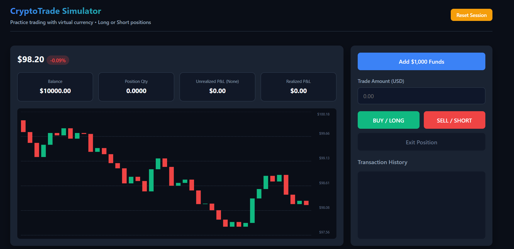

# Trading Simulator

A web-based trading simulator that replicates the experience of real trading using virtual currency. Perfect for someone looking to practice (satisfy their addiction) without risking actual money.

## Features

- Simulate long and short positions
- Add virtual funds anytime
- Real-time PnL tracking per session
- Uses Normal distribution for candlestick patterns

## Screenshot

